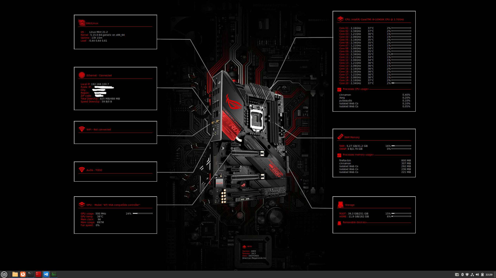

# Conky

Conky is a free, light-weight system monitor for X, that displays any kind of information on your desktop.

You can find more information about conky :point_right: [here](https://github.com/brndnmtthws/conky)

## Motivation
It's allways nice to know how your computer feels and what it does. I got inspired by some similar configs and Conky personalizations. There is still smole work to be done and this si not final version.  

## Screenshots

## Features
Currently, the gadgets are able to:

- OS version info woth up time.
- Show CPU, RAM load with top five processes. 
- Show HDD usage with all inserted removable devices. (everithing mounted to /media/curentuser)
- Show ethernet status with local and public IP address and geo location information.
- Bios info

There is much more to be done, like wifi, bluetooth and audio info. Also the scripts should be changed so user name will be detected dynamically. 

## Installation

Just fallow Conky installation guide and then copy all config and script files to ./config/conky folder. 

conkyx-start.sh will start all Conky instances with their configs. That script can be added to startup.

I made a background according to my moatherboard. There is .xcf file, so you can edit it however you want and replace moatherboard. 

##Usage
Run it and enjoy it.

## License
MIT © [Kosteron]()
